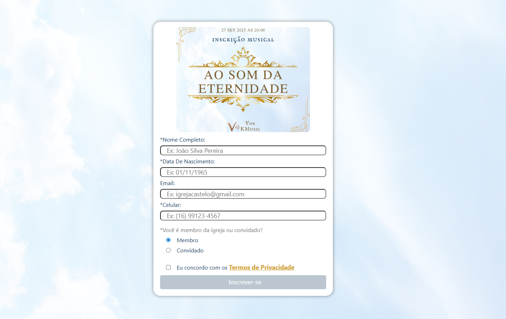
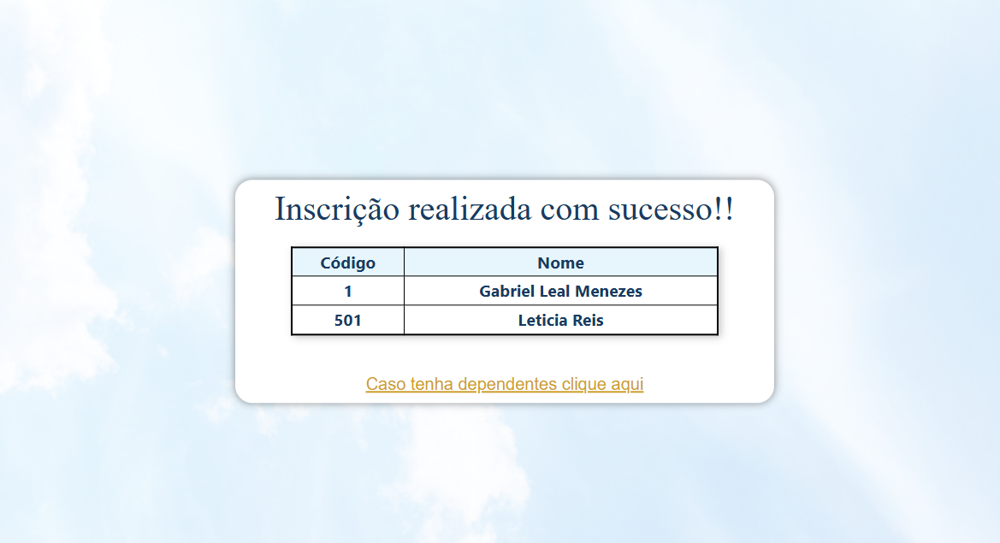
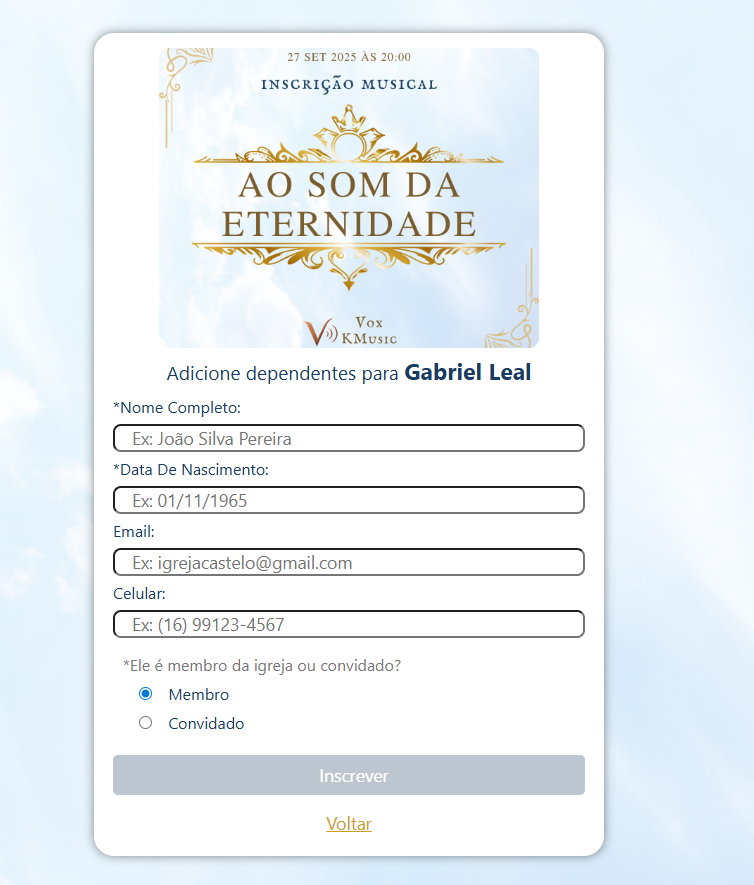
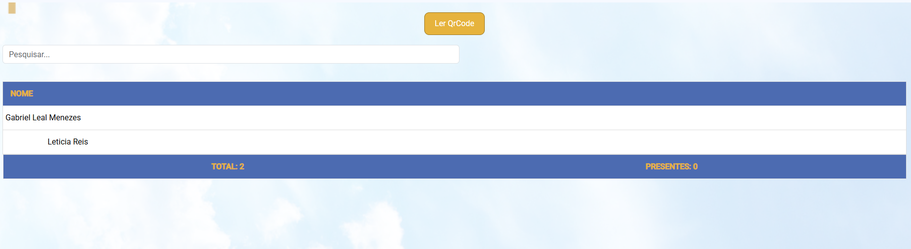
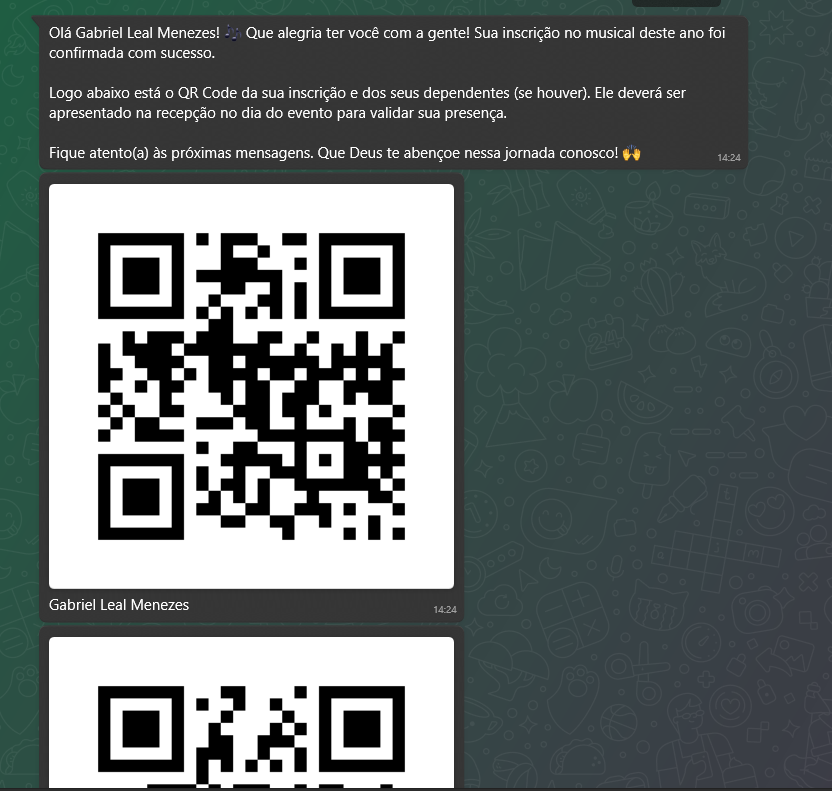

# 🎵 Sistema de Inscrição do Musical da minha igreja Igreja  
  
  
  
  

---

## 📖 Sobre o Projeto

Este sistema foi desenvolvido para **organizar e automatizar as inscrições** do musical anual da minha igreja.  
antigamente com google FORMS, com mensagens manuais no WhatsApp e controle de presença confuso.  

Agora:  
- O participante se inscreve online.  
- Recebe um **QR Code** exclusivo no WhatsApp.  
- No dia do evento, apresenta o código na recepção para **validação imediata**.

---

## ✨ Funcionalidades
- 📋 Inscrição online de participantes
- 👨‍👩‍👧 Cadastro de dependentes
- 📱 Geração automática de QR Code
- 💬 Envio do QR Code via API Evolution (WhatsApp)
- 🛂 Validação de presença na recepção
- 📊 Controle centralizado em MySQL

---

## 📸 Fluxo do Sistema

| Etapa | Descrição |
|-------|-----------|
| **1️⃣ Inscrição** | Participante preenche formulário online |
| **2️⃣ Dependentes** | Participante cadastra seus dependentes |
| **3️⃣ QR Code** | Sistema gera e envia via WhatsApp |
| **4️⃣ Validação** | Recepção escaneia o QR Code |

---

## Imagens do Projeto

### Tela de Inscrição

### Tela de Inscritos

### Tela de Dependentes

### Validação na recepção

### Exemplo de QrCode

### mensagem no Whatsapp

